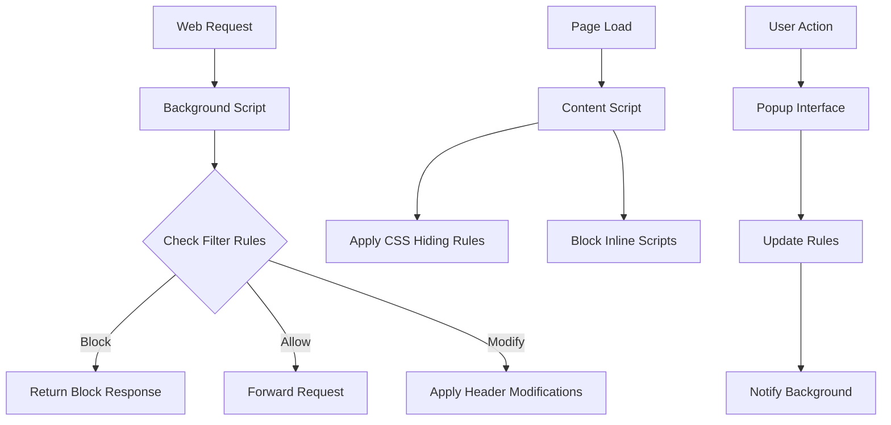
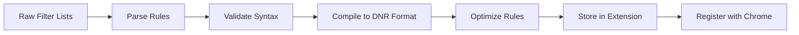

# Chrome AdBlock - Minimalist Ad Blocking Extension

> A lightweight, high-performance ad blocker built with modern Chrome extension architecture and Go-inspired simplicity.

## 🎯 Project Overview

Chrome AdBlock is a streamlined ad blocking extension that provides comprehensive ad filtering without the complexity. Built with Manifest V3 and designed for performance, it blocks ads from known services while maintaining a clean, minimalist interface.

### Core Value Proposition
- **Zero Configuration**: Works out of the box with sensible defaults
- **High Performance**: Efficient filtering with minimal resource usage
- **Clean Interface**: Simple on/off toggle with essential statistics
- **Privacy First**: Local filtering with no data collection
- **Developer Friendly**: Clean codebase with clear architecture

## 🚀 Key Features

### Primary Features
- **Comprehensive Blocking**: Blocks ads, trackers, and malware domains
- **Filter Lists**: EasyList, EasyPrivacy, and other standard lists
- **Custom Rules**: User-defined blocking and allow rules
- **Whitelist Support**: Easy site-specific disabling
- **Performance Stats**: Blocked requests and page load improvements

### Advanced Features
- **Element Hiding**: CSS-based cosmetic filtering
- **Script Blocking**: Prevents execution of ad scripts
- **Tracking Protection**: Blocks analytics and tracking pixels
- **Malware Protection**: Blocks known malicious domains
- **Memory Optimization**: Efficient rule compilation and caching

## 🛠️ Technical Implementation

### Extension Structure
```
chrome-adblock/
├── manifest.json              # Extension configuration
├── background/
│   ├── service-worker.js     # Main background script
│   ├── filter-engine.js      # Core filtering logic
│   ├── rule-compiler.js      # Filter list compilation
│   └── update-manager.js     # Filter list updates
├── content/
│   ├── content-script.js     # DOM manipulation
│   ├── element-hider.js      # CSS injection for cosmetic filtering
│   └── script-blocker.js     # JavaScript blocking
├── popup/
│   ├── popup.html           # Extension popup UI
│   ├── popup.js             # Popup functionality
│   └── popup.css            # Popup styling
├── options/
│   ├── options.html         # Settings page
│   ├── options.js           # Settings logic
│   └── options.css          # Settings styling
├── filters/
│   ├── default-rules.json   # Built-in filter rules
│   ├── whitelist.json       # Default whitelist
│   └── custom-rules.json    # User custom rules
├── assets/
│   ├── icons/              # Extension icons
│   └── blocklist-sources.json # Filter list URLs
└── docs/
    ├── README.md
    └── FILTERS.md
```

### Core Architecture


### Technology Stack
- **Manifest V3**: Modern Chrome extension architecture
- **Declarative Net Request**: Efficient request blocking
- **Chrome APIs**:
  - `chrome.declarativeNetRequest` for request filtering
  - `chrome.storage` for settings and rules
  - `chrome.tabs` for tab-specific actions
  - `chrome.scripting` for content script injection

## 🎯 Filtering Strategy

### Request Blocking
- **Domain-based**: Block requests to known ad domains
- **Pattern Matching**: URL pattern-based filtering
- **Header Filtering**: Block based on request headers
- **Resource Type**: Block specific resource types (images, scripts, etc.)

### Content Filtering
- **Element Hiding**: CSS selectors to hide ad elements
- **Script Injection**: Remove ad-related JavaScript
- **Iframe Blocking**: Prevent ad iframe loading
- **Placeholder Removal**: Clean up empty ad containers

### Filter Lists Integration
```javascript
// Filter List Sources
const FILTER_SOURCES = {
  easylist: 'https://easylist.to/easylist/easylist.txt',
  easyprivacy: 'https://easylist.to/easylist/easyprivacy.txt',
  malware: 'https://malware-filter.gitlab.io/malware-filter/urlhaus-filter.txt',
  custom: 'local://custom-rules.json'
};
```

## 📋 User Interface Design

### Popup Interface
```
┌─────────────────────────┐
│ Chrome AdBlock          │
├─────────────────────────┤
│ ● Enabled on this site  │
│                         │
│ Blocked today: 1,247    │
│ Blocked total: 45,892   │
│                         │
│ ⚙️  Settings            │
│ 📊 Statistics           │
│ 🛡️  Whitelist this site │
└─────────────────────────┘
```

### Settings Page
- **Filter Lists**: Enable/disable specific filter lists
- **Custom Rules**: Add personal blocking/allowing rules
- **Whitelist**: Manage site-specific exceptions
- **Performance**: Memory usage and blocking statistics
- **Updates**: Filter list update frequency and status

## 🔧 Development Roadmap

### Phase 1: Core Functionality (Week 1-2)
- [ ] Basic extension structure and manifest
- [ ] Declarative Net Request rule compilation
- [ ] Default filter list integration
- [ ] Simple popup interface
- [ ] Basic request blocking

### Phase 2: Content Filtering (Week 3-4)
- [ ] Content script injection
- [ ] Element hiding implementation
- [ ] CSS cosmetic filtering
- [ ] Script blocking functionality
- [ ] Iframe and embed blocking

### Phase 3: User Interface (Week 5-6)
- [ ] Popup interface completion
- [ ] Settings page implementation
- [ ] Statistics tracking and display
- [ ] Whitelist management
- [ ] Custom rule editor

### Phase 4: Advanced Features (Week 7-8)
- [ ] Filter list auto-updates
- [ ] Performance optimization
- [ ] Import/export functionality
- [ ] Advanced filtering options
- [ ] Chrome Web Store preparation

## 📊 Filter Rule Processing

### Rule Compilation Flow


### Performance Optimization
- **Rule Deduplication**: Remove duplicate filters
- **Pattern Optimization**: Combine similar patterns
- **Priority Sorting**: Order rules by effectiveness
- **Memory Management**: Efficient rule storage
- **Update Batching**: Batch rule updates for performance

## 🛡️ Security Considerations

### Privacy Protection
- **Local Processing**: All filtering happens locally
- **No Data Collection**: Zero telemetry or analytics
- **Secure Updates**: Verified filter list sources
- **Sandboxed Execution**: Content scripts run in isolation

### Malware Protection
- **Malicious Domain Blocking**: Known bad actors
- **Phishing Protection**: Suspicious URL patterns
- **Crypto Mining**: Block cryptocurrency miners
- **Malvertising**: Block malicious advertisements

## 🧪 Testing Strategy

### Unit Testing
- Filter rule compilation accuracy
- URL pattern matching logic
- Storage and retrieval operations
- Performance benchmarking

### Integration Testing
- Cross-browser compatibility
- Filter list update mechanisms
- Content script injection
- API interaction testing

### Performance Testing
- Memory usage under load
- Rule compilation speed
- Page load impact measurement
- Large filter list handling

## 📈 Success Metrics

### Technical Performance
- **Memory Usage**: <50MB RAM consumption
- **Rule Compilation**: <2s for full filter lists
- **Page Load Impact**: <5% additional load time
- **Blocking Accuracy**: >95% ad blocking effectiveness

### User Experience
- **Installation**: One-click setup
- **Configuration**: Zero required configuration
- **Interface**: <3 clicks to common actions
- **Reliability**: 99.9% uptime

## 🔄 Filter List Management

### Automatic Updates
```javascript
// Update Schedule
const UPDATE_INTERVALS = {
  easylist: 24 * 60 * 60 * 1000,        // 24 hours
  easyprivacy: 24 * 60 * 60 * 1000,     // 24 hours
  malware: 6 * 60 * 60 * 1000,          // 6 hours
  custom: 0                              // Manual only
};
```

### Rule Format Support
- **EasyList Format**: Standard ad blocking syntax
- **uBlock Origin**: Compatible with uBO filters
- **Hosts Files**: Simple domain blocking
- **Custom JSON**: Structured rule definitions

## 🚀 Advanced Features

### Future Enhancements
- **Machine Learning**: Adaptive filtering based on user behavior
- **Cloud Sync**: Sync settings across devices
- **Reporting**: Detailed blocking reports and analytics
- **API Integration**: Third-party filter sources

### Developer Features
- **Debug Mode**: Detailed logging and rule inspection
- **Rule Testing**: Test custom rules against specific URLs
- **Performance Profiling**: Identify slow rules
- **Export Tools**: Share custom rule sets

## 📄 Documentation Structure

### User Documentation
- **Quick Start**: Installation and basic usage
- **Advanced Usage**: Custom rules and settings
- **Troubleshooting**: Common issues and solutions
- **FAQ**: Frequently asked questions

### Developer Documentation
- **Architecture**: Technical design overview
- **API Reference**: Extension API usage
- **Filter Syntax**: Rule writing guide
- **Contributing**: Development setup and guidelines

## 🎯 Success Definition

The Chrome AdBlock extension is successful when:
- Users experience significantly fewer ads without configuration
- Page load times remain fast despite filtering
- The interface feels intuitive and unobtrusive
- Filter lists stay current with minimal user intervention
- The extension runs reliably across all major websites

---

*This project focuses on delivering the core ad blocking functionality with exceptional performance and simplicity. The goal is to create a tool that works invisibly in the background while providing comprehensive ad protection.*
